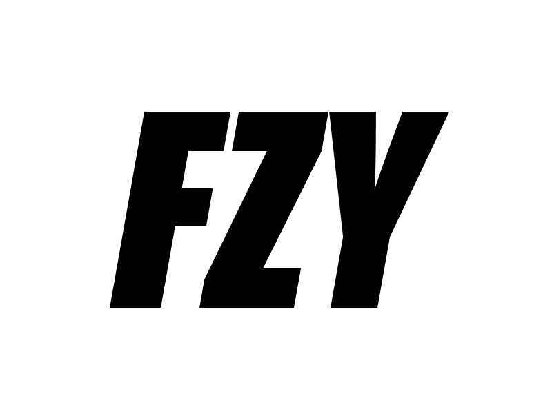

## Sobre FZY

**Fresh Your Zone (FZY)** es una aplicación web pensada para la compra y venta de ropa entre usuarios. Permite a compradores y vendedores registrarse, subir productos, gestionar pedidos y comunicarse de forma sencilla. Nuesrto objetivo es ofrecer una experiencia rápida, segura y visualmente atractiva para quienes buscan renovar su estilo o dar una segunda vida a sus prendas.

## Funcionalidades Principales
- Registro y autenticacion de usuarios 
- Subida de productos con imágenes, descripciones y categorías
- Sistema de pedidos y gestión de ventas
- Panel de administración con gestión de usuarios, productos y pedidos
- Diseño responsive optimizado para dispositivos móviles y escritorio
- Modo claro y oscuro 

## Tecnologías utilizadas
- Laravel
- MySQL
- Bootstrap 5
- Git y  GitHub para control de versiones

## FZY Sponsors
Queremos agradecer a los sponsors que apoyan el desarrollo de FZY. Si estas interesado en ser un sponsor, por favor visita este [enlace de afiliación](https://www.google.com/url?sa=i&url=https%3A%2F%2Fx.com%2FDefensaAnimalZA%2Fstatus%2F1450733997156360194&psig=AOvVaw2n66AvogwpcA9r8J4LHViI&ust=1748433841333000&source=images&cd=vfe&opi=89978449&ved=0CBQQjRxqFwoTCOD_-uHNw40DFQAAAAAdAAAAABAE).

## Instalación del proyecto
 ### 1. Clonar el repositorio
 Ejecuta en tu terminal el siguiente comando para clonar el repositorio.
 `git clone https://github.com/FranParedesNavarrete/Fresh-Your-Zone.git`

 ### 2. Instalar las dependencias
 Ejecuta en tu terminal el siguiente comando para instalar composer dentro de la carpeta del proyecto.
 `composer install`
 Instala 
 `npm install && npm run dev`.

 ### 3. Crear el archivo .env y configurar las credenciales
 Ejecuta `cp .env.example .env` para copiar como `.env` si usas Mac/Unix/Linux.
 Ejecuta `copy .env.example .env` para copiar como `.env` si usas Windows.

 ### 4.Ejecutar las migraciones
 php artisan migrate:fresh

 ### 5. Arrancar el servidor
 php artisan serve
 *Si usas Laragon no hace falta ejecutar el comando, solo inicia el servidor desde la interfaz.

## Contribuciones
Las contribuciones son acptadas, no dudes en enviar tus Pull Requests, abrir issues o sugerir mejoras. 

## Licencia
Este proyecto usa la licencia [MIT](https://opensource.org/licenses/MIT).

Gracias por visitar FZY
 